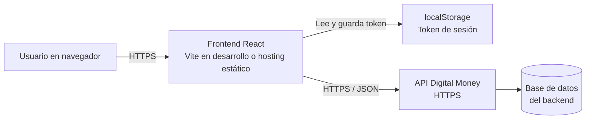

# Infraestructura - Sprint 1

## Objetivo

Ejecutar la aplicación React de Digital Money House desde un navegador y conectarla al backend provisto por Digital House mediante HTTPS.

## Componentes

| Componente | Responsabilidad |
| --- | --- |
| Usuario | Accede desde desktop, tablet o móvil mediante un navegador. |
| Frontend React | Muestra la landing, registro, login, home y logout. Durante el desarrollo corre con Vite en `localhost:5173`. |
| Hosting estático | Publica el build del frontend en una entrega futura. Puede ser GitLab Pages, Vercel o Netlify. |
| Backend Digital Money | Expone la API REST en `https://digitalmoney.digitalhouse.com`. |
| Base de datos del backend | Almacena usuarios, cuentas, servicios y operaciones. El frontend no accede a ella directamente. |
| Almacenamiento local del navegador | Conserva el token de sesión luego del login. |

## Flujo de red

## Seguridad aplicada en el Sprint 1

- El frontend consume la API únicamente por HTTPS.
- La contraseña se envía al backend solo durante registro o login.
- El token se guarda en `localStorage` para mantener la sesión al recargar.
- Las rutas privadas verifican la existencia del token antes de mostrar `/home`.
- El logout elimina el token local y regresa a la landing.

## Alcance local

Durante el desarrollo, el navegador abre `http://localhost:5173`. Vite sirve el frontend y las llamadas `fetch` viajan al dominio seguro del backend. Para la entrega, se genera la carpeta `dist` con `npm run build` y se publica como sitio estático.
